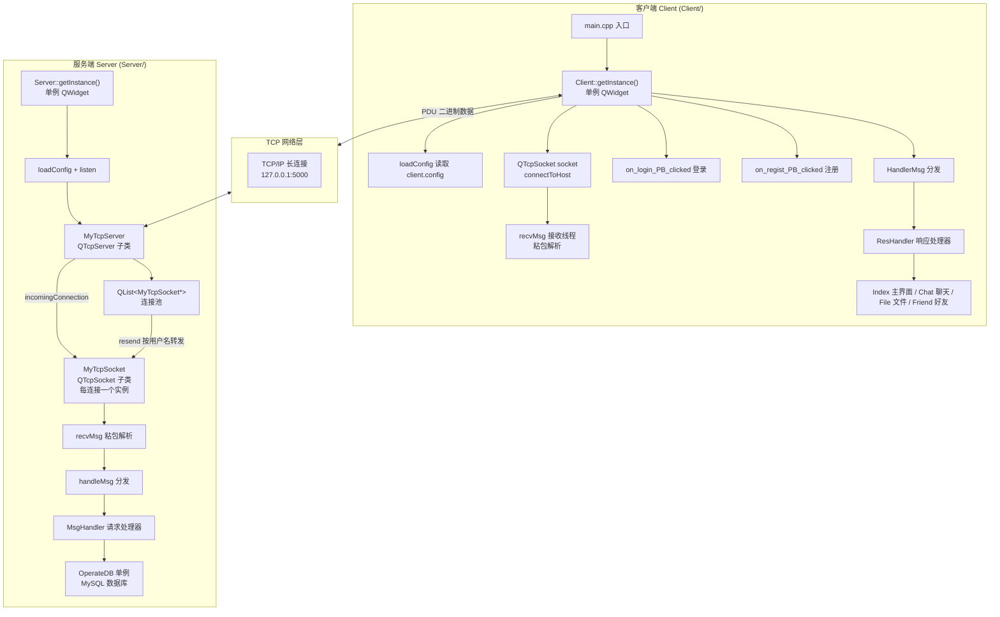
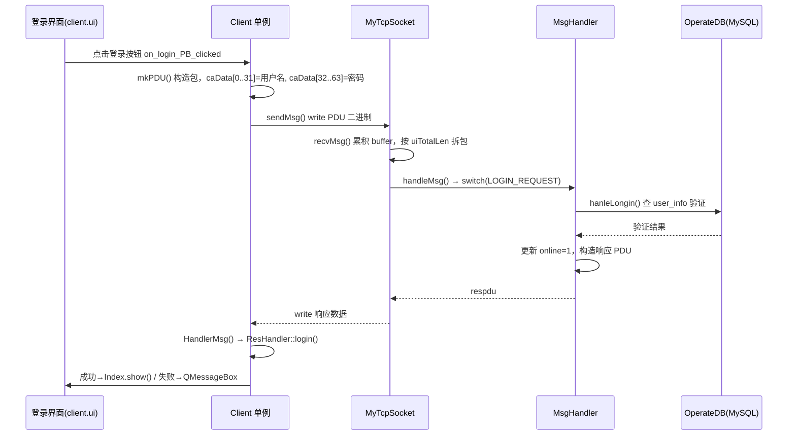
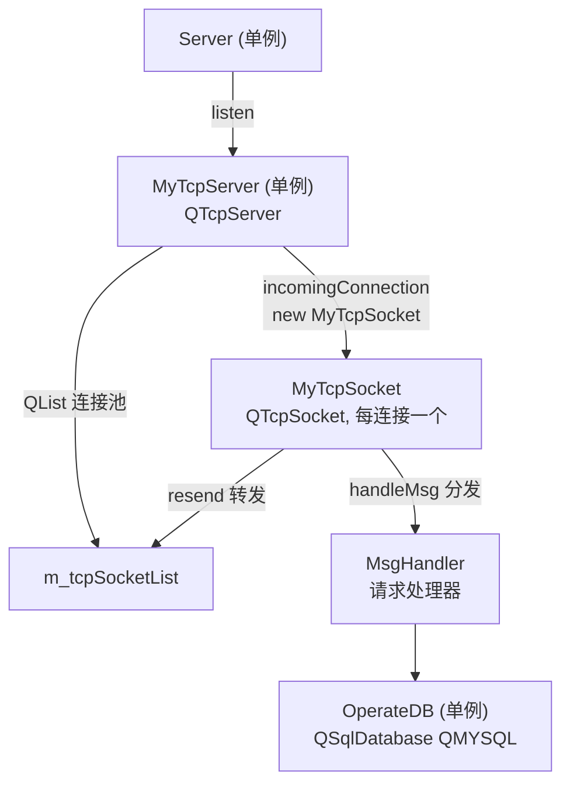

# Qt TcpChat - 基于 Qt TCP 的网络即时通讯与文件管理系统

## 项目运行展示

| 客户端（登录/注册界面） | 客户端（主界面 + 好友/聊天） | 服务端（日志监听） |
|:---:|:---:|:---:|
|  |  |  |

*（占位图：请将实际运行截图重命名为 `show_login.png`、`show_main.png`、`show_server.png` 放入项目根目录）*

---

## 目录

- [1. 项目概述](#1-项目概述)
- [2. 系统架构](#2-系统架构)
  - [2.1 整体架构图](#21-整体架构图)
  - [2.2 登录流程时序图](#22-登录流程时序图)
- [3. 项目文件结构](#3-项目文件结构)
- [4. 通信协议设计](#4-通信协议设计)
  - [4.1 PDU 协议结构](#41-pdu-协议结构)
  - [4.2 消息类型枚举](#42-消息类型枚举)
  - [4.3 TCP 粘包/拆包处理](#43-tcp-粘包拆包处理)
- [5. 类结构与设计模式](#5-类结构与设计模式)
- [6. 核心流程详解](#6-核心流程详解)
  - [6.1 注册流程](#61-注册流程)
  - [6.2 登录流程](#62-登录流程)
  - [6.3 添加好友流程](#63-添加好友流程)
  - [6.4 一对一聊天流程](#64-一对一聊天流程)
  - [6.5 文件管理流程](#65-文件管理流程)
- [7. 数据库设计](#7-数据库设计)
- [8. 关键技术点与 Qt/C++ 知识点](#8-关键技术点与-qtc-知识点)
- [9. 构建与运行](#9-构建与运行)
- [10. 待优化项](#10-待优化项)
- [11. 知识索引](#11-知识索引)

---

## 1. 项目概述

Qt TcpChat 是一个基于 **C++/Qt5 框架** 开发的双端网络程序，包含 **Client（客户端）** 与 **Server（服务端）** 两个独立 Qt 工程：

- **客户端（Client）**：提供图形界面，支持用户注册、登录、查找用户、添加/删除好友、一对一聊天；并集成文件管理模块，支持创建/删除/重命名文件夹和文件。
- **服务端（Server）**：基于 TCP 监听客户端连接，通过 MySQL 数据库管理用户信息与好友关系，负责消息转发与在线状态维护。

两端通过 **自定义二进制协议 PDU（Protocol Data Unit）** 交互，核心类采用 **单例模式** 管理，是典型的 **Qt 网络编程 + 数据库** 综合项目。

**核心特性：**

- `QTcpServer` / `QTcpSocket` 实现 TCP 长连接通信
- 自定义二进制协议（PDU 结构体 + 30 余种消息类型，请求/响应成对）
- 服务端维护 `QList<MyTcpSocket*>` 连接池，按用户名精准转发消息
- TCP 粘包/拆包处理（`QByteArray` 累积缓冲 + 按 `uiTotalLen` 逐包解析）
- 单例模式管理 `Client` / `Server` / `MyTcpServer` / `OperateDB` 核心类
- MySQL 数据库管理用户账号、在线状态与好友关系
- 配置文件（IP/端口/文件根目录）通过 `config.qrc` 编译进二进制

---

## 2. 系统架构

### 2.1 整体架构图



### 2.2 登录流程时序图



---

## 3. 项目文件结构

```
2503cpy/
├── README.md                         # 本文档
├── CLAUDE.md                         # Claude Code 项目说明
├── 项目说明.txt                       # 原项目知识点文档
│
├── Client/                           # 客户端工程（独立 .git + .pro）
│   ├── Client.pro                    # qmake 项目文件（QT += core gui network）
│   ├── main.cpp                      # 入口：Client::getInstance().show()
│   ├── client.h / client.cpp         # 客户端单例（连接、收发、分发）
│   ├── reshandler.h / reshandler.cpp # 服务端响应处理器
│   ├── index.h / index.cpp           # 主界面（登录后显示）
│   ├── friend.h / friend.cpp         # 好友列表窗口
│   ├── chat.h / chat.cpp             # 一对一聊天窗口
│   ├── file.h / file.cpp             # 文件管理窗口
│   ├── olineuser.h / olineuser.cpp   # 在线用户窗口
│   ├── protocol.h / protocol.cpp     # 通信协议（PDU 定义 + mkPDU 工厂）
│   ├── client.config                 # 配置（IP / 端口 / 文件根目录）
│   ├── config.qrc                    # 将 client.config 编译进资源
│   ├── *.ui                          # Qt Designer 界面文件
│   ├── dir.png / file.png            # 文件管理图标
│   │
│   │   # ↓ 以下为 git 合并残留的服务端文件，不在 Client.pro 中编译
│   ├── server.h / server.cpp
│   ├── mytcpserver.h / mytcpserver.cpp
│   ├── mytcpsocket.h / mytcpsocket.cpp
│   ├── msghandler.h / msghandler.cpp
│   └── operatedb.h / operatedb.cpp
│
├── Server/                           # 服务端工程（独立 .git + .pro）
│   ├── Server.pro                    # qmake 项目文件（QT += core gui network sql）
│   ├── main.cpp                      # 入口：连库 + 启动服务
│   ├── server.h / server.cpp         # 服务端单例（加载配置 + 监听）
│   ├── mytcpserver.h / mytcpserver.cpp  # QTcpServer 子类（连接池）
│   ├── mytcpsocket.h / mytcpsocket.cpp  # QTcpSocket 子类（单连接收发）
│   ├── msghandler.h / msghandler.cpp    # 请求处理器
│   ├── operatedb.h / operatedb.cpp      # 数据库单例（MySQL 增删改查）
│   ├── protocol.h / protocol.cpp        # 通信协议（与客户端一致）
│   ├── client.config                  # 配置（IP / 端口 / 文件根目录）
│   └── config.qrc                     # 资源文件
│
├── build-Client-Desktop_Qt_5_14_2_MinGW_64_bit-Debug/   # 客户端构建产物
└── build-Server-Desktop_Qt_5_14_2_MinGW_64_bit-Debug/   # 服务端构建产物
```

---

## 4. 通信协议设计

### 4.1 PDU 协议结构

系统自定义了一套二进制通信协议，定义在 `protocol.h`（客户端与服务端各持一份**完全相同**的拷贝）：

```
+----------------+----------------+----------------+----------------+----------------+
| uiTotalLen (4B)| uiMsgLen (4B)  |  uiType (4B)   | caData (64B)   | caMsg (变长)   |
+----------------+----------------+----------------+----------------+----------------+
|  整个包的总长度  |  消息体长度      |   消息类型       |  固定数据区      |  消息体         |
+----------------+----------------+----------------+----------------+----------------+
                 |<------- 固定头部 sizeof(PDU) = 76 字节 -------->|
                 |<-------------- PDU 总大小 = 76 + uiMsgLen -------------->|
```

```cpp
typedef unsigned uint;

struct PDU {
    uint uiTotalLen;   // 整个包的总长度（头部 + 消息体）
    uint uiMsgLen;     // caMsg 消息体的长度
    uint uiType;       // 消息类型（见 ENUM_MSG_TYPE）
    char caData[64];   // 固定 64 字节数据区（用户名/密码等）
    char caMsg[];      // 柔性数组：变长消息体，不占结构体大小
};
```

**`caData` 语义**（按消息类型不同而不同）：

| 消息类型 | caData[0..31] | caData[32..63] |
|----------|---------------|----------------|
| 注册/登录请求 | 用户名 | 密码 |
| 查找用户请求 | 目标用户名 | 空 |
| 添加好友请求 | 对方用户名 | 空 |
| 聊天请求 | 发送者 | 目标用户名 |
| 删除好友 | 本方用户名 | 对方用户名 |
| 文件重命名 | 旧文件名 | 新文件名 |

### 4.2 消息类型枚举

| 枚举名 | 值 | 方向 | 说明 |
|--------|-----|------|------|
| `ENUM_MSG_TYPE_REGIST_REQUEST` | 1 | C→S | 注册请求 |
| `ENUM_MSG_TYPE_LOGIN_REQUEST` | 2 | C→S | 登录请求 |
| `ENUM_MSG_TYPE_REGIST_RESPOND` | 3 | S→C | 注册响应 |
| `ENUM_MSG_TYPE_LOGINT_RESPOND` | 4 | S→C | 登录响应 |
| `ENUM_MSG_TYPE_FINDUSER_REQUEST` | 5 | C→S | 查找用户请求 |
| `ENUM_MSG_TYPE_FINDUSERT_RESPOND` | 6 | S→C | 查找用户响应 |
| `ENUM_MSG_TYPE_ONLINEUSER_REQUEST` | 7 | C→S | 在线用户请求 |
| `ENUM_MSG_TYPE_ONLINEUSER_RESPOND` | 8 | S→C | 在线用户响应 |
| `ENUM_MSG_TYPE_ADDFRIEND_REQUEST` | 9 | C→S | 添加好友请求 |
| `ENUM_MSG_TYPE_ADDFRIEND_RESPOND` | 10 | S→C | 添加好友响应 |
| `ENUM_MSG_TYPE_ADDFRIEND_AGREE_REQUEST` | 11 | C→S | 同意好友请求 |
| `ENUM_MSG_TYPE_ADDFRIEND_AGREE_RESPOND` | 12 | S→C | 同意好友响应 |
| `ENUM_MSG_TYPE_FLUSH_FRIEND_REQUEST` | 13 | C→S | 刷新好友列表请求 |
| `ENUM_MSG_TYPE_FLUSH_FRIEND_RESPOND` | 14 | S→C | 刷新好友列表响应 |
| `ENUM_MSG_TYPE_DEL_FRIEND_REQUEST` | 15 | C→S | 删除好友请求 |
| `ENUM_MSG_TYPE_DEL_FRIEND_RESPOND` | 16 | S→C | 删除好友响应 |
| `ENUM_MSG_TYPE_CHAT_FRIEND_REQUEST` | 17 | C→S | 聊天消息请求 |
| `ENUM_MSG_TYPE_CHAT_FRIEND_RESPOND` | 18 | S→C | 聊天消息响应 |
| `ENUM_MSG_TYPE_DIKER_FILE_REQUEST` | 19 | C→S | 创建文件夹请求 |
| `ENUM_MSG_TYPE_DIKER_FILE_RESPOND` | 20 | S→C | 创建文件夹响应 |
| `ENUM_MSG_TYPE_FLUSH_FILE_REQUEST` | 21 | C→S | 刷新文件列表请求 |
| `ENUM_MSG_TYPE_FLUSH_FILE_RESPOND` | 22 | S→C | 刷新文件列表响应 |
| `ENUM_MSG_TYPE_DEL_FILE_REQUEST` | 23 | C→S | 删除文件请求 |
| `ENUM_MSG_TYPE_DEL_FILE_RESPOND` | 24 | S→C | 删除文件响应 |
| `ENUM_MSG_TYPE_RENAME_FILE_REQUEST` | 25 | C→S | 重命名请求 |
| `ENUM_MSG_TYPE_RENAME_FILE_RESPOND` | 26 | S→C | 重命名响应 |

> 每种业务操作都严格成对定义 `_REQUEST`（请求）与 `_RESPOND`（响应）。

### 4.3 TCP 粘包/拆包处理

TCP 是字节流协议，`send()`/`write()` 的边界不保证与 `recv()`/`read()` 一致。本项目通过 **累积缓冲区 + 按长度拆包** 解决（客户端与服务端逻辑一致）：

```cpp
// client.cpp: recvMsg()
void Client::recvMsg() {
    QByteArray data = socket.readAll();
    buffer.append(data);                       // 1. 累积到缓冲区
    while (buffer.size() >= int(sizeof(PDU))) { // 2. 至少有一个头部
        PDU* pdu = (PDU*)buffer.data();        // 3. 头部强转为 PDU
        if (buffer.size() < int(pdu->uiTotalLen)) {  // 4. 数据不完整，等待
            break;
        }
        HandlerMsg(pdu);                       // 5. 处理完整包
        buffer.remove(0, pdu->uiTotalLen);     // 6. 移除已处理的包
    }
}
```

**协议工厂函数**（`protocol.cpp`）：

```cpp
PDU *mkPDU(uint uiMsgLen = 0) {
    uint uiTotalLen = sizeof(PDU) + uiMsgLen;   // 总长度 = 头部 + 消息体
    PDU* pdu = (PDU*)malloc(uiTotalLen);        // 动态分配
    memset(pdu, 0, uiTotalLen);                 // 清零
    pdu->uiMsgLen   = uiMsgLen;
    pdu->uiTotalLen = uiTotalLen;
    return pdu;
}
```

---

## 5. 类结构与设计模式

### 5.1 服务端类关系



### 5.2 单例模式（核心类全部采用）

```cpp
// 单例实现技巧：私有构造 + 删除拷贝 + 静态局部变量
class Client : public QWidget {
    Q_OBJECT
private:
    Client(QWidget *parent = nullptr);          // 构造函数私有
    Client(const Client& instance) = delete;    // 禁止拷贝构造
    Client& operator=(const Client&) = delete;  // 禁止赋值
public:
    static Client& getInstance() {
        static Client instance;                  // C++11 线程安全静态局部变量
        return instance;
    }
};
```

| 单例类 | 所在工程 | 职责 |
|--------|----------|------|
| `Client` | Client | 客户端全局连接与消息收发 |
| `Index` | Client | 登录后的主界面 |
| `Server` | Server | 服务端配置加载与监听启动 |
| `MyTcpServer` | Server | TCP 服务器，维护连接池 |
| `OperateDB` | Server | 数据库连接与所有 SQL 操作 |

### 5.3 策略分发雏形

`MsgHandler`（服务端）与 `ResHandler`（客户端）针对不同的 `uiType` 通过 `switch-case` 分发到各自的处理方法，构成"按消息类型分发处理"的策略模式雏形：

```cpp
// MyTcpSocket::handleMsg() 中
switch (pdu->uiType) {
case ENUM_MSG_TYPE_REGIST_REQUEST:  respdu = m_pmh->regist();   break;
case ENUM_MSG_TYPE_LOGIN_REQUEST:   respdu = m_pmh->login(...); break;
case ENUM_MSG_TYPE_CHAT_FRIEND_REQUEST: respdu = m_pmh->ChatFriend(); break;
// ...
}
```

---

## 6. 核心流程详解

### 6.1 注册流程

```
客户端 on_regist_PB_clicked()
├── 校验用户名/密码非空且 ≤32 字节
├── mkPDU() 构造包
├── memcpy caData[0..31] = 用户名
├── memcpy caData[32..63] = 密码
├── uiType = REGIST_REQUEST
└── sendMsg() 发送
    │
    └── 服务端 MsgHandler::regist()
        ├── 解析用户名/密码
        ├── OperateDB::hanleRegist()
        │   ├── SELECT 检查用户名是否已存在
        │   ├── 存在 → 返回 false
        │   └── 不存在 → INSERT 插入 user_info
        ├── 注册成功 → QDir::mkdir 为用户创建个人文件夹
        └── 返回 REGIST_RESPOND（caData 携带 bool 结果）
```

### 6.2 登录流程

```
客户端 on_login_PB_clicked()
├── mkPDU() 构造 LOGIN_REQUEST
├── m_strLoginName = 用户名（记录登录身份）
├── caData[0..31] = 用户名, caData[32..63] = 密码
└── sendMsg()
    │
    └── 服务端 MsgHandler::login()
        ├── OperateDB::hanleLongin()
        │   ├── SELECT 验证用户名+密码
        │   └── 成功 → UPDATE online=1
        ├── 成功 → 记录 m_strLoginName（用于转发身份）
        └── 返回 LOGINT_RESPOND
            │
            └── 客户端 ResHandler::login()
                ├── 成功 → Index::getInstance().show() 打开主界面
                └── 失败 → QMessageBox "登录失败"
```

### 6.3 添加好友流程

```
添加好友（三段握手）
├── ① 客户端发送 ADDFRIEND_REQUEST（caData = 对方用户名）
│   └── 服务端 handleaddFriend() 查询对方在线状态
│       ├── 已是好友 → 返回 -2
│       ├── 在线 → resend 转发请求给对方
│       └── 不在线 → 返回 0
├── ② 对方客户端收到 ADDFRIEND_REQUEST
│   └── ResHandler::addFriend_agree() 弹窗询问是否同意
│       └── 同意 → 发送 ADDFRIEND_AGREE_REQUEST
├── ③ 服务端 handleaddFriend_agree() 写 friend 表
│   └── 双方收到 ADDFRIEND_AGREE_RESPOND
│       └── ResHandler::addFriend_WIN() 提示"添加成功"
```

### 6.4 一对一聊天流程

```
发送方 chat 窗口
├── 构造 CHAT_FRIEND_REQUEST
│   ├── caData[0..31] = 发送者名
│   ├── caData[32..63] = 目标用户名
│   └── caMsg = 聊天内容
└── sendMsg()
    │
    └── 服务端 MsgHandler::ChatFriend()
        └── MyTcpServer::resend(目标用户名, pdu)
            └── 遍历连接池，按 m_strLoginName 匹配目标用户
                └── 匹配成功 → write 转发（不落库）
```

### 6.5 文件管理流程

```
文件操作（均以 caMsg 携带当前路径，caData 携带文件名）
├── 创建文件夹 DIKER_FILE
│   └── 服务端 DikerFile(): QDir::mkdir(路径/文件名)
├── 刷新列表 FLUSH_FILE
│   └── 服务端 Flushfile(): QDir::entryInfoList() 遍历目录
│       └── caMsg 填充 FileInfo[]{caName[32], uiType}（0=目录, 1=文件）
├── 删除 DEL_FILE
│   └── 服务端 delfile(): 目录→removeRecursively, 文件→remove
└── 重命名 RENAME_FILE
    └── 服务端 Renamefile(): QDir::rename(旧路径, 新路径)
```

---

## 7. 数据库设计

系统使用 Qt SQL 模块的 `QMYSQL` 驱动连接 MySQL（[operatedb.cpp L15-L28](Server/operatedb.cpp#L15)）：

| 配置项 | 值 |
|--------|-----|
| 驱动 | `QMYSQL` |
| 主机 | `localhost` |
| 端口 | `3306` |
| 数据库 | `test` |
| 用户 | `root` |
| 密码 | `123456` |

**建表 SQL：**

```sql
CREATE DATABASE test;
USE test;

CREATE TABLE user_info (
    id INT AUTO_INCREMENT PRIMARY KEY,
    name VARCHAR(32) NOT NULL UNIQUE,
    pwd  VARCHAR(32) NOT NULL,
    online TINYINT DEFAULT 0
);

CREATE TABLE friend (
    id INT AUTO_INCREMENT PRIMARY KEY,
    user_id INT NOT NULL,
    friend_id INT NOT NULL
);
```

| 表名 | 字段 | 说明 |
|------|------|------|
| `user_info` | `id`, `name`, `pwd`, `online` | 用户账号与在线状态 |
| `friend` | `id`, `user_id`, `friend_id` | 双向好友关系 |

**多表关联查询**（刷新好友列表，[operatedb.cpp L166-L181](Server/operatedb.cpp#L166)）：通过子查询将 `friend` 表的 `user_id`/`friend_id` 反查 `user_info` 表得到在线好友姓名，`UNION` 合并双向关系。

---

## 8. 关键技术点与 Qt/C++ 知识点

### 8.1 Qt 网络编程 — QTcpSocket / QTcpServer

```cpp
// 客户端连接
#include <QTcpSocket>
socket.connectToHost(QHostAddress(m_strIP), m_usPort);
connect(&socket, &QTcpSocket::connected,    this, &Client::showConnect);
connect(&socket, &QTcpSocket::readyRead,    this, &Client::recvMsg);

// 服务端监听（重写 incomingConnection）
class MyTcpServer : public QTcpServer {
    void incomingConnection(qintptr handle) override {
        MyTcpSocket* pSocket = new MyTcpSocket;
        pSocket->setSocketDescriptor(handle);   // 绑定新连接的描述符
        m_tcpSocketList.append(pSocket);        // 加入连接池
    }
};
```

| 知识点 | 说明 |
|--------|------|
| **QTcpSocket** | 客户端/单连接套接字，`readyRead` 信号表示有数据可读 |
| **QTcpServer** | 服务端监听套接字，`listen()` 后由 `incomingConnection()` 处理新连接 |
| **setSocketDescriptor** | 将底层 socket 描述符绑定到 QTcpSocket 实例 |
| **长连接管理** | 服务端用 `QList<MyTcpSocket*>` 维护所有在线连接 |

### 8.2 自定义二进制协议

```cpp
struct PDU {
    uint uiTotalLen;   // 总长度
    uint uiMsgLen;     // 消息体长度
    uint uiType;       // 消息类型
    char caData[64];   // 固定数据区
    char caMsg[];      // 柔性数组（C99，不占结构体大小）
};
```

| 知识点 | 说明 |
|--------|------|
| **柔性数组** | `char caMsg[]` 作为结构体最后成员，实际大小由 `malloc` 决定 |
| **工厂函数** | `mkPDU()` 统一分配、清零、初始化长度字段 |
| **请求-响应模式** | 每种业务都有 `_REQUEST` 与 `_RESPOND` 成对枚举 |
| **typedef uint** | 自定义无符号整型别名 |

### 8.3 TCP 粘包/拆包

```cpp
QByteArray buffer;
void recvMsg() {
    buffer.append(socket.readAll());          // 累积
    while (buffer.size() >= (int)sizeof(PDU)) {
        PDU* pdu = (PDU*)buffer.data();
        if (buffer.size() < (int)pdu->uiTotalLen) break;  // 半包等待
        HandlerMsg(pdu);                       // 处理完整包
        buffer.remove(0, pdu->uiTotalLen);     // 移除
    }
}
```

| 知识点 | 说明 |
|--------|------|
| **粘包** | 多个小包可能被合并到一次 `readAll()` 返回 |
| **拆包** | 一次可能只收到半个包，需累积到完整再处理 |
| **QByteArray** | 字节缓冲区，`append()`/`remove()` 维护动态缓冲 |

### 8.4 Qt 数据库 — QSqlDatabase / QSqlQuery

```cpp
m_db = QSqlDatabase::addDatabase("QMYSQL");
m_db.setHostName("localhost");
m_db.setPort(3306);
m_db.setUserName("root");
m_db.setPassword("123456");
m_db.setDatabaseName("test");
m_db.open();

// 参数化查询（防 SQL 注入）
QString sql = QString("select * from user_info where name='%1'").arg(caName);
QSqlQuery q;
q.exec(sql);
while (q.next()) { ... }   // 遍历结果集
```

| 知识点 | 说明 |
|--------|------|
| **QSqlDatabase** | 数据库连接抽象，`addDatabase("QMYSQL")` 加载驱动 |
| **QSqlQuery** | 执行 SQL 语句并遍历结果集 |
| **参数化** | `QString::arg()` 拼参数，避免字符串拼接（**注：本项目用 `.arg()` 而非预编译占位符，仍存在注入风险**，见待优化项） |
| **数据库单例** | `OperateDB::getInstance()` 全局唯一连接 |

### 8.5 单例模式与内存管理

```cpp
// 单例（私有构造 + 删除拷贝 + 静态局部变量）
Client(const Client&) = delete;
Client& operator=(const Client&) = delete;
static Client& getInstance() {
    static Client instance;
    return instance;
}

// PDU 手动内存管理
PDU* pdu = mkPDU(len);   // malloc 分配
free(pdu);               // 用后释放
```

| 知识点 | 说明 |
|--------|------|
| **单例模式** | 全局唯一实例，避免重复创建连接 |
| **`=delete`** | C++11 显式禁用拷贝构造/赋值 |
| **malloc/free** | C 风格内存管理，与 `memcpy` 搭配使用 |
| **RAII 缺失** | PDU 用 `malloc`/`free` 手动管理，易泄漏（见待优化项） |

### 8.6 Qt 容器

| 容器 | 用途 | 位置 |
|------|------|------|
| `QList<MyTcpSocket*>` | 服务端连接池 | `mytcpserver.h` |
| `QList<FileInfo*>` | 文件列表 | `file.h` |
| `QStringList` | 好友/在线用户姓名列表 | `reshandler.cpp` |
| `QByteArray` | 网络缓冲区 | `client.h` / `mytcpsocket.h` |

### 8.7 Qt 文件操作

| 知识点 | 用途 | 位置 |
|--------|------|------|
| `QFile` | 读取 `client.config` 配置文件 | `client.cpp` |
| `QDir` | 创建/删除/重命名目录、遍历文件 | `msghandler.cpp` |
| `QFileInfoList` | 列出目录内文件 | `msghandler.cpp` |
| `QFile::remove` / `QDir::removeRecursively` | 删除文件/递归删除目录 | `msghandler.cpp` |

### 8.8 Qt 资源系统 — QRC

```pro
RESOURCES += config.qrc   # 将 client.config 嵌入二进制
```

```cpp
QFile file(":/client.config");   // 通过资源路径读取（编译进程序）
```

| 知识点 | 说明 |
|--------|------|
| **QRC** | Qt 资源文件，将配置文件/图片编译进二进制，运行时无需外部文件 |
| **资源路径** | 以 `:/` 前缀访问嵌入的资源 |

---

## 9. 构建与运行

### 9.1 环境要求

| 组件 | 要求 |
|------|------|
| 操作系统 | Windows（Qt 5.14.2 MinGW 64-bit 套件） |
| Qt 版本 | Qt 5.x（需 `core gui network sql widgets` 模块） |
| 编译器 | MinGW 64-bit 或 MSVC（C++11） |
| 数据库 | MySQL 5.7+（需建 `test` 库及两张表） |

### 9.2 构建步骤

```bash
# 服务端
cd Server
qmake Server.pro
make          # Windows 下为 mingw32-make

# 客户端
cd Client
qmake Client.pro
make
```

> 也可用 Qt Creator 分别打开 `Server/Server.pro` 与 `Client/Client.pro`，选择 `Desktop_Qt_5_14_2_MinGW_64_bit` 套件后构建。

### 9.3 配置说明（client.config）

Client 与 Server 目录下各有一份 `client.config`，内容格式为 3 行，通过 `config.qrc` 编译进程序：

```
127.0.0.1     # 第 1 行：服务器 IP 地址
5000          # 第 2 行：端口号
./filesys     # 第 3 行：用户文件存储根目录
```

> 服务端会在该根目录下为每个注册用户创建一个专属文件夹。**两端 IP/端口需保持一致。**

### 9.4 运行步骤

1. 启动 MySQL，执行 [建表 SQL](#7-数据库设计)。
2. **先启动服务端**：运行 `Server` 产物 → 自动连接数据库并监听端口。
3. **再启动客户端**：运行 `Client` 产物 → 注册账号 → 登录 → 添加好友 → 聊天。
4. 文件管理模块可创建/浏览文件夹、删除/重命名文件。

---

## 10. 待优化项

| 优先级 | 项目 | 说明 |
|--------|------|------|
| 高 | 凭证明文存储 | 数据库账号密码、用户密码均明文硬编码（`operatedb.cpp`），应加密/配置化 |
| 高 | SQL 注入风险 | `.arg()` 拼接字符串仍可注入，应改用 `QSqlQuery::bindValue()` 预编译参数 |
| 高 | 粘包指针悬垂 | `(PDU*)buffer.data()` 直接指向 `QByteArray` 内部缓冲，`remove()` 重分配后可能悬垂 |
| 高 | 连接池未维护 | `MyTcpServer::removeSocket()` 只 `deleteLater`，未从 `m_tcpSocketList` 移除，列表会积累悬垂指针 |
| 高 | 内存泄漏 | PDU 用 `malloc`/`free` 手动管理，多处错误分支未释放（如 `addFriend` 提前 return） |
| 中 | 响应分发冗余 | `switch-case` 中多处 `break` 缺失（`client.cpp` 的 `HandlerMsg`），易误触后续分支 |
| 中 | 误调用 | `ENUM_MSG_TYPE_DIKER_FILE_REQUEST` 分支误调用 `delFriend()`（`client.cpp:141-144`） |
| 中 | 密码明文传输 | 登录/注册密码以明文走 TCP，公网场景应加 TLS 或哈希 |
| 低 | 目录残留 | `Client/` 下残留服务端源文件（`server.cpp`/`operatedb.cpp` 等），非 `Client.pro` 编译项，应清理 |
| 低 | 枚举命名 | `LOGINT`、`DIKER` 等拼写错误，`FINDUSERT` 少字母，影响可读性 |
| 低 | 聊天响应 | `CHAT_FRIEND_RESPOND`（值 18）未在任何 `switch` 中处理，属冗余定义 |
| 低 | 硬编码 | IP/端口/文件根目录虽可配置，但数据库连接信息硬编码在 `operatedb.cpp` |

---

## 11. 知识索引

本项目涉及的 **Qt / C++ / MySQL** 核心知识点速查：

```
┌─ Qt 网络编程
│  ├─ QTcpSocket (connectToHost / readyRead / disconnected)
│  ├─ QTcpServer (listen / incomingConnection)
│  ├─ setSocketDescriptor 绑定连接
│  ├─ 长连接连接池 (QList<MyTcpSocket*>)
│  └─ 消息转发 resend (按用户名匹配)
├─ 通信协议
│  ├─ PDU 结构体 (uiTotalLen / uiMsgLen / uiType / caData / caMsg)
│  ├─ 柔性数组 char caMsg[]
│  ├─ 消息类型枚举 (ENUM_MSG_TYPE, 请求/响应成对)
│  ├─ 工厂函数 mkPDU (malloc + memset)
│  └─ TCP 粘包/拆包 (QByteArray 累积 + 按长度解析)
├─ Qt SQL
│  ├─ QSqlDatabase (addDatabase / open / lastError)
│  ├─ QMYSQL 驱动
│  ├─ QSqlQuery (exec / next / value)
│  └─ 多表关联查询 (子查询 + UNION)
├─ Qt 核心机制
│  ├─ 信号与槽 (clicked / readyRead / connected)
│  ├─ 元对象系统 (Q_OBJECT / moc)
│  ├─ QUi::setupUi 加载界面
│  ├─ QRC 资源文件 (config.qrc)
│  └─ QDebug 调试输出
├─ 设计模式
│  ├─ 单例模式 (Client/Server/MyTcpServer/OperateDB/Index)
│  ├─ 工厂函数 (mkPDU)
│  └─ 策略分发 (MsgHandler/ResHandler switch)
├─ Qt 容器
│  ├─ QList / QStringList / QByteArray
│  └─ QFileInfoList
├─ Qt 文件操作
│  ├─ QFile (readAll / remove)
│  ├─ QDir (mkdir / rename / removeRecursively / entryInfoList)
│  └─ QTextEdit (append)
├─ C++ 语言特性
│  ├─ =delete 禁用拷贝
│  ├─ memcpy 内存操作
│  ├─ enum 枚举 / typedef 别名
│  ├─ 柔性数组
│  └─ 前置声明 namespace Ui { class X; }
└─ 构建系统
   ├─ qmake (.pro)
   ├─ QT += core gui network sql widgets
   └─ CONFIG += c++11
```
